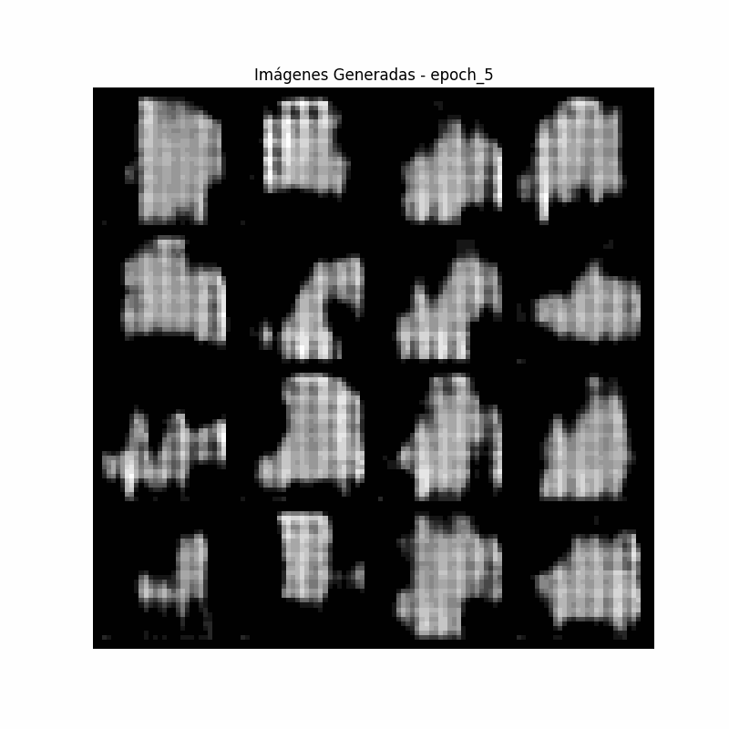

# Zalando MNIST GAN Project 👕👖🧤👚👗👘

## Description
A Generative Adversarial Network (GAN) implementation for generating synthetic fashion images, trained on the Zalando Fashion-MNIST dataset.


## 🚀 Features
- GAN architecture implemented in PyTorch
- Training on Fashion-MNIST dataset
- Real-time visualization of generated images
- Model checkpointing and loading


## 🛠️ Installation
1. Clone the repository:
```bash
git clone https://github.com/yourusername/zalando-mnist-gan.git
cd zalando-mnist-gan
```

2. Install dependencies:
```bash
pip install -r requirements.txt
```

## 💻 Usage
Run the Jupyter notebook:
```bash
jupyter notebook ZalandoMNIST_GAN.ipynb
```

## 📁 Project Structure
```
├── ZalandoMNIST_GAN.ipynb   # Main training notebook
├── models/                   # Saved model checkpoints
├── README.md                # Project documentation
└── requirements.txt         # Python dependencies
```

## 🔧 Model Architecture
- **Generator**: Neural network that generates synthetic fashion images
- **Discriminator**: Neural network that distinguishes real from fake images

## 📈 Results
Training results and generated samples will be displayed in the notebook.

## 📄 License
This project is licensed under the MIT License - see the LICENSE file for details.
